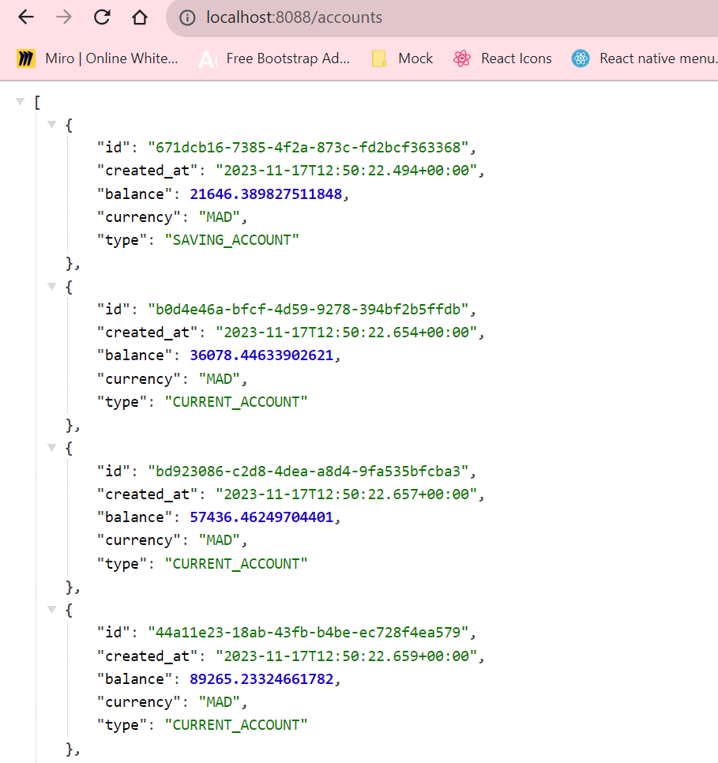
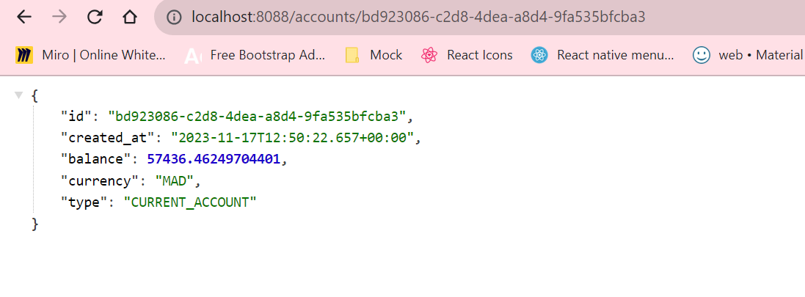
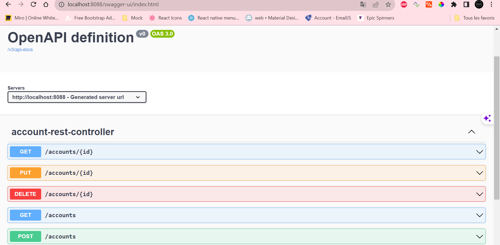
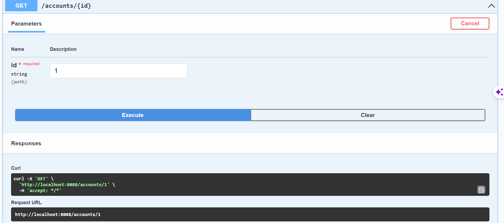
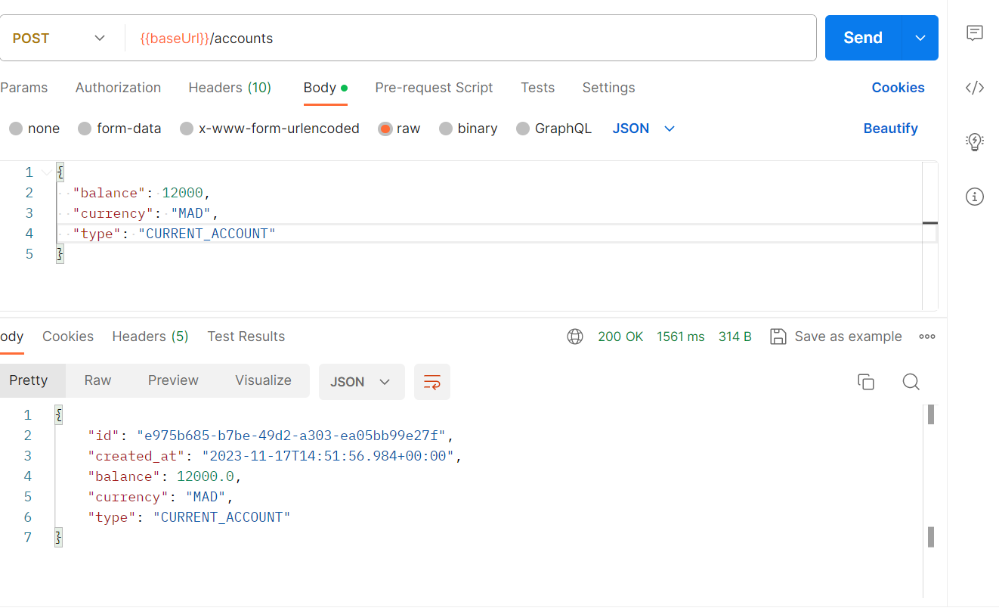
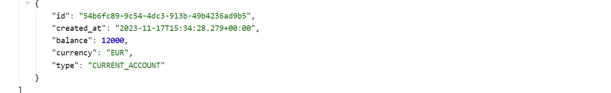
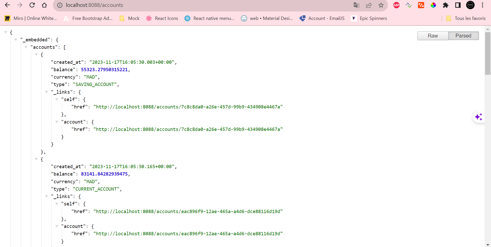
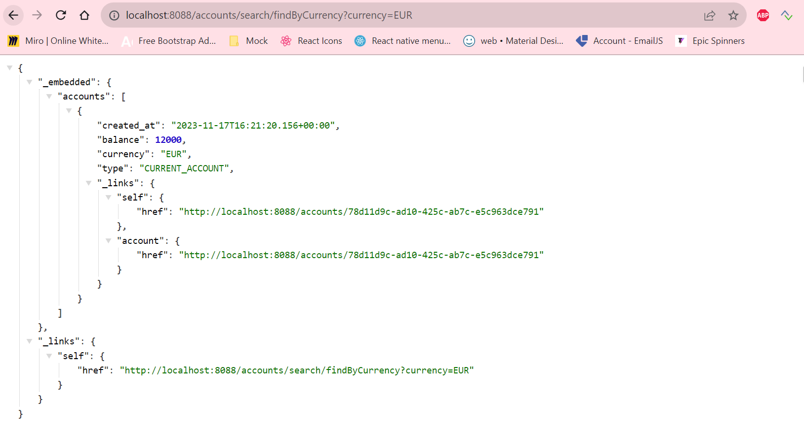
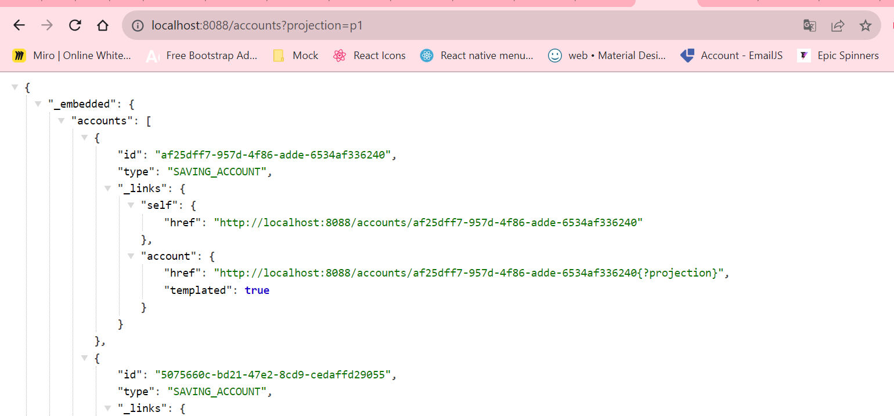
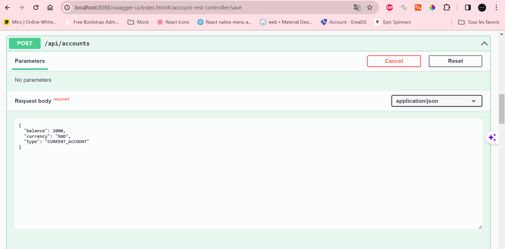

# BankAccount MicroService
# MAWUVIWO Yawa Brinda
Cette repository Git abrite un projet Spring Boot avec les dépendances Web, Spring Data JPA, H2, Lombok,
fournissant un microservice de gestion de comptes bancaires avec API RESTful, documentation Swagger,
exposant également une API RESTful via Spring Data Rest, et intégrant une couche Service ainsi qu'un microservice GraphQL.
<h5>RestController du webservice</h5>

Consultation de tous les comptes

Consultation d'un compte à partir de son id

<h5>Ajout de la documentation OpenAPI</h5>

Documentation du RestAPI | Interface du webservice

Test de getAccount à partir de Swagger

<h1>Test du web micro-service en utilisant un client REST,Postman</h1>
<h6>Methode Post pour ajouter un nouveau compte</h6>

Ajout réussi

Vérification de l'ajout du nouveau compte

<h1>Exposition de l'API Restful en utilisant Spring Data Rest en exploitant des projections</h1>

Après l'ajout de la dependance Spring-data-Rest, il faut annoter l'interface Repository avec @RepositoryRestResource. Nous rechargons l'API Rest

Le Spring data rest utilise maintenant le path <b>/accounts</b>

Test de la methode findByCurrency ajoutée dans l'interface de Spring Data Rest

<h3>Les projections avec Spring Data Rest</h3>

<h2>Utilisation des Mappers</h2>

